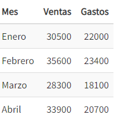

# Reto 7
Elaborar un solucion para cada unos los propblemas propuestos en esta seccion utilizando las estructuras aprendidas en las sesiones DataFrame y Series si es necesario.

# Problema 1

Escribir programa que genere y muestre por pantalla un DataFrame con los datos de la tabla siguiente:

# Problema 2
Escribir una función que reciba un DataFrame con el formato del ejercicio anterior, una lista de meses, y devuelva el balance (ventas - gastos) total en los meses indicados.

# Problema 3
Escribir un programa que pregunte al usuario por las ventas de un rango de años y muestre por pantalla una serie con los datos de las ventas indexada por los años, antes y después de aplicarles un descuento del 10%.

# Problema 4
Escribir una función que reciba un diccionario con las notas de los alumno de un curso y devuelva una serie con la nota mínima, la máxima, media y la desviación típica.

# Problema 5
Escribir una función que reciba un diccionario con las notas de los alumno de un curso y devuelva una serie con la nota mínima, la máxima, media y la desviación típica.

NOTA: Luego de implementar la solucion para cada uno de los problemas importar comentado # al main para poder evaluar la funcionalidad de cada solucion.